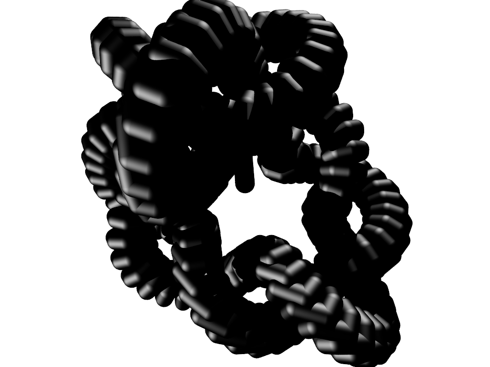

A parodic take on the complexity of the https://github.com/ialhashim/powercrust
code.

## Original example


The figure was made by executing:
```
powercrust -m 100000 -i knot.pts
```

## knotty example


The figure was made by executing:

```
./knotty <knot.pts >knot.pov
povray -W400 -H300 +A0.3 knot.pov
```

(different scene angle, but you get the idea)
